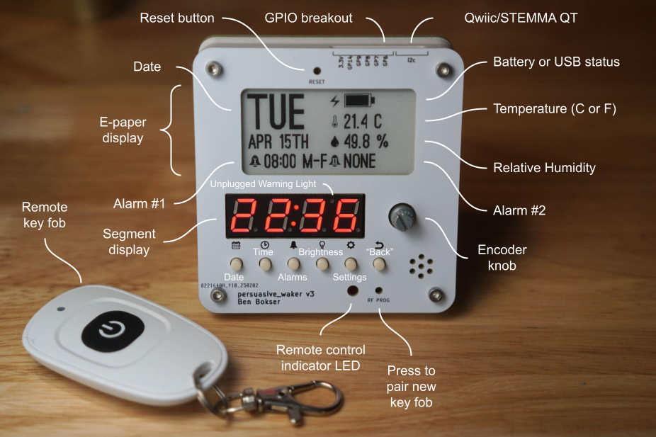

# persuasive_waker



Persuasive Waker is an open source hardware alarm clock that can't be snoozed or turned off. The alarm is deactivated via a remote key fob, which should be placed as far from the user's bed as possible. E.g. in the bathroom.

The KiCad design files are located in the [`hw`](hw) folder.

The STEP assembly is located [here](hw/step/).

If you just want STLs for printing, they're [here](hw/stl).

## BoM
| Item          | QTY| Source |
| --------------| ---|--|
| Case          | 1  | 3D Print |
| Screen Holder | 1  | 3D Print |
| Spacer        | 2  | 3D Print |
| M2.5x0.45-12-SHCS-SS304 | 4  | |
| M2.5x0.45-6-SHCS-SS304 | 4  | |
| M2.5x0.45-4-FHS-SS304 | 2 | |
| PRESSNUT-M2.5x0.45-SS304 | 2 | [Mouser](https://mou.sr/3FToM2v)|
| Battery Holder | 1 | [Mouser](https://mou.sr/4lddciV) |
| THRIN-M2.5X0.45-HS-PL-4L3.5D-BR | 8 | [Amazon](https://www.amazon.com/dp/B0DGPL6RWT)|
| E-Paper Display | 1 | [AliExpress](https://www.aliexpress.us/item/2251832627460771.html)|
| Key Fob | 1 | [AliExpress](https://www.aliexpress.us/item/2251832657961546.html) |
| Alarm PCB | 1 | Custom PCBA Order |
| Front Plate | 1 | Custom PCB Order  |
| Rear Plate | 1 | Custom PCB Order  |


## Mechanical Build
1. Print the case, screen holder, and two spacers.
2. Install the heat-set inserts in the case (x8).
3. Insert the PCB from the front.
4. Plug the E-paper display into the FPC connector.
5. Put the screen holder and spacers into position and then fold the display down onto it. Make sure the display is properly nestled in.
6. Holding the display down, put the front cover on.
7. Screw the front cover on with the M2.5x12 screws.
8. Using an arbor press, press the press-fit nuts into the rear cover.
9. Screw the battery holder onto the rear cover using the flat head screws and loctite. Insert AA batteries.
10. Plug the battery holder into the power connector on the back of the PCB.
11. Screw the rear cover on using the M2.5x6 screws.

## Firmware Setup
1. Install CircuitPython on your Pico by following [this](https://learn.adafruit.com/getting-started-with-raspberry-pi-pico-circuitpython/circuitpython) guide.

2. Install [circup](https://learn.adafruit.com/keep-your-circuitpython-libraries-on-devices-up-to-date-with-circup/prepare) on your computer.

3. Run the following commands to install all necessary libraries.

    ```
    circup bundle-add adafruit/circuitpython-fonts
    circup install adafruit_sht4x adafruit_ssd1680 adafruit_display_text adafruit_ds3231 adafruit_datetime adafruit_display_shapes font_ostrich_sans_black_30 font_ostrich_sans_black_72
    ```
4. Delete `code.py` from the Pico's storage.

5. Clone this repo onto your computer and copy+paste everything in the `src` folder to the Pico's storage.

6. The alarm clock should be functioning now.

## User Manual
See [here](user_manual.md).